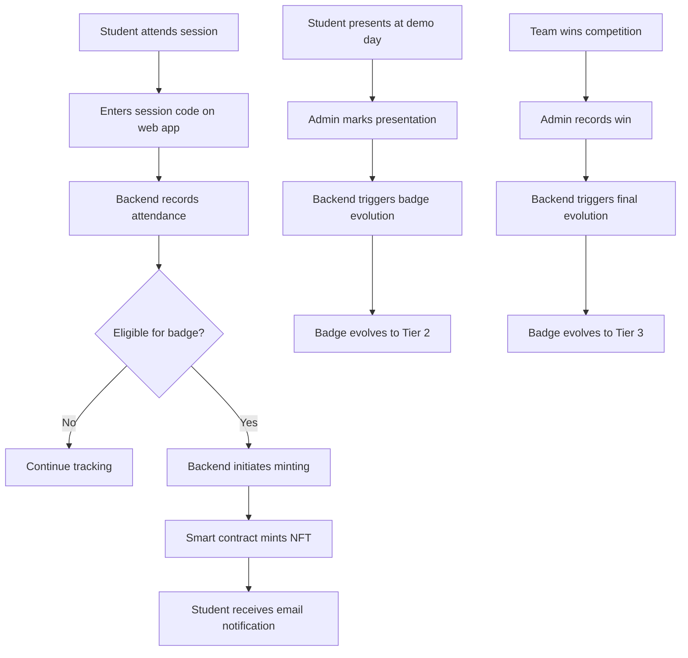

# InnoHub Web3: Evolving NFT Badge System

   

## Overview

InnoHub Web3 is a comprehensive digital recognition platform designed to incentivize student attendance and participation in the 8-week Innovators Hub program. The system rewards student engagement through an evolving NFT badge system on the Polygon blockchain, creating a visual representation of their achievements throughout the program.

## Key Features

- **Attendance Tracking**: Web application for recording student participation using session codes
- **Evolving NFT Badges**: Three-tier NFT badge system that evolves based on student achievements
- **Blockchain Integration**: Seamless minting and evolution of badges on the Polygon network
- **Student-Friendly UI**: Simple interface that requires no prior blockchain knowledge
- **Admin Dashboard**: Tools for session management, attendance monitoring, and badge administration

## Architecture

InnoHub Web3 follows a modern architecture with these key components:

### Frontend (React TypeScript)

- Modern React with TypeScript for type safety
- Mobile-responsive design for in-class check-ins
- Simple student-facing interface for badge claiming

### Smart Contracts (Solidity)

- ERC-721 NFT implementation with metadata upgrade capabilities
- OpenZeppelin libraries for security and standardization
- Gas-optimized for cost-effective operation on Polygon

### Backend (Django)

- RESTful API endpoints for attendance tracking
- Web3.py integration for blockchain communication
- Administrative tools for program management

## Flow



## Badge Tiers

The NFT badge system features three distinct tiers that evolve based on student achievements:

1. **Tier 1: Attendance Badge**
   - Granted after attending 6 out of 8 weekly sessions
   - Represents consistent participation in the program
   
2. **Tier 2: Presenter Badge**
   - Evolution of Tier 1 badge for students who present during demo day
   - Signifies active contribution to the program
   
3. **Tier 3: Winner Badge**
   - Final evolution awarded to competition winners
   - Represents exceptional achievement and innovation

## Project Structure

```plaintext
innohub.web3/
├── contracts/                  # Solidity smart contracts
│   ├── BadgeNFT.sol            # Core NFT implementation
│   ├── IBadgeNFT.sol           # Interface definitions
│   └── libraries/              # Helper contracts and utilities
│
├── frontend/                   # React TypeScript frontend
│   ├── public/                 # Static assets
│   └── src/                    # Frontend source code
│
├── backend/                    # Django application
│   ├── attendance/             # Attendance tracking
│   ├── badges/                 # Badge management
│   └── web3/                   # Blockchain integration
│
├── scripts/                    # Deployment and utility scripts
│   ├── deploy.js               # Contract deployment
│   └── verify.js               # Contract verification
│
├── test/                       # Contract test suite
│   └── BadgeNFT.test.js        # NFT functionality tests
│
├── LICENSE                     # MIT License
└── README.md                   # This file
```

## Getting Started

### Prerequisites

- Node.js 16+
- Python 3.8+
- Metamask or other Web3 wallet
- MATIC tokens for gas (Polygon Mumbai testnet)

### Smart Contract Setup

```bash
# Navigate to project root
cd innohub.web3

# Install dependencies
npm install

# Compile contracts
npx hardhat compile

# Deploy to Mumbai testnet (requires .env configuration)
npx hardhat run scripts/deploy.js --network mumbai
```

### Frontend Setup
```bash
# Navigate to frontend directory
cd frontend

# Install dependencies
npm install

# Start development server
npm start
```

## Usage

### For Students

1. Attend InnoHub sessions and get the session code from founders
2. Visit the web application on your mobile device
3. Enter your student ID and the session code
4. After reaching 6 sessions, you'll receive an email with a link to claim your NFT
5. Present during demo day to evolve your badge to Tier 2
6. Win the competition to achieve the Tier 3 badge

### For Administrators

1. Log in to the admin dashboard
2. Generate unique session codes for each meeting
3. Monitor student attendance and badge statuses
4. Manually trigger badge evolutions for demo day participants and winners
5. View analytics on program participation

## Technologies Used

- **Smart Contracts**: Solidity, Hardhat, OpenZeppelin
- **Frontend**: React, TypeScript, ethers.js
- **Backend**: Django, Web3.py, SQLite
- **Blockchain**: Polygon (Mumbai testnet/mainnet)
- **Storage**: IPFS for badge metadata and images

## Commit Message Guidelines

We follow a simple commit message format to make the project history readable. Each commit message should be structured as follows:

`<emoji> <type>: <subject>`

### Types and Emojis

| Emoji | Type | Description |
|-------|------|-------------|
| ✨ | `feat` | New feature or enhancement |
| 🐛 | `fix` | Bug fix |
| 📝 | `docs` | Documentation changes |
| 💄 | `style` | Code formatting, styling (no code change) |

### Examples

- ✨ feat: add SQL injection pattern detection
- 🐛 fix: resolve false positive in XSS detection
- 📝 docs: update installation instructions
- 💄 style: format code according to style guide

## License

This project is licensed under the MIT License - see the [`LICENSE`](LICENSE) file for details.

## Contact

Project Maintainer: Ethan Leonard

Project Link: [https://github.com/ethan-leonard/innohub.web3](https://github.com/ethan-leonard/innohub.web3)

---

**Note**: This project is currently under development. Features and implementation details are subject to change.